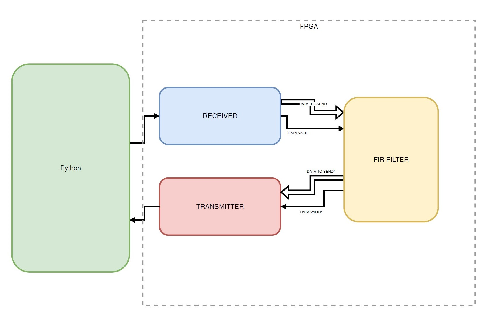

Designing of a low-Pass **FIR filter** both in VHDL and python to compare the results by a frequence analysis. The low-Pass FIR filter chose has 4 “taps” 
behavior in the frequency domain.
The whole project was first testebenched via **GTKwave software** and then implemented with VHDL in a real **FPGA**.

**Response Signal FPGA**

